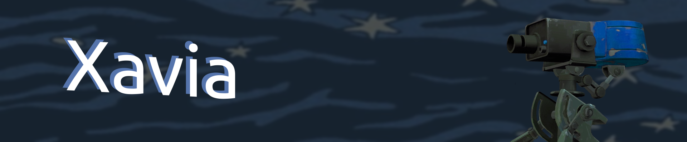

Энтузиаст, самоучка и начинающий Flutter-разработчик.
---

  

    <h2>🛠 Навыки</h2>
    <ul>
      <li><strong>Flutter</strong></li>
      <li><strong>Adobe Photoshop</strong></li>
      <li><strong>Adobe Illustrator</strong></li>
      <li><strong>Figma</strong></li>
    </ul>
  

  

    
  

